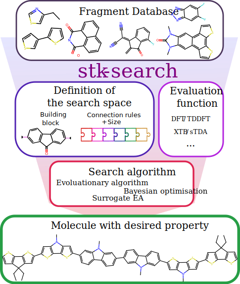

:Author: Mohammed Azzouzi
:Docs: https://stk-search.readthedocs.io


<div align="center">
  <h1>stk-search</h1>
  <h2>Search over the space of molecules built from fragments</h2>
</div>

<p align="center">
  
</p>

## Overview

`stk_search` is a Python package for searching the chemical space of molecules formed by `stk`. It is built on top of `stk` and `stko`. For more details on the use of the package, please refer to the corresponding publication as well as the documentation associated with it.

We use [stk](https://github.com/lukasturcani/stk) and [stko](https://github.com/JelfsMaterialsGroup/stko) for building and calculating the properties of the molecules.

We use [BoTorch](https://botorch.org/) for the implementation of the Bayesian optimization.

For the implementation of the geometric modeling on 3D structure, we use the implementation of models in [GEOM3D](https://github.com/chao1224/Geom3D).

## Installation

To install the package, follow these steps:

1. **Open a terminal and change to the directory where the `pyproject.toml` file is located.**
    ```bash
    cd path/to/directory
    ```

2. **Create a new conda environment**
    ```bash
    conda create -n stk_search python=3.8
    ```

3. **Activate the environment**
    ```bash
    conda activate stk_search
    ```

4. **Run the following command to install the package:**
    In some cases, you may need to install `gcc` before installing the package.
    ```bash
    pip install -e .
    ```

5. **Install additional packages to use the GNN model:**

    **For GPU:**
    ```bash
    pip install torch_scatter torch_sparse torch_cluster torch_spline_conv -f https://data.pyg.org/whl/torch-2.3.0+cu121.html
    # Make sure the torch version is the right one
    ```

    **For CPU:**
    ```bash
    pip install torch_scatter torch_sparse torch_cluster torch_spline_conv -f https://data.pyg.org/whl/torch-2.3.0+cpu.html
    ```

## Usage

Refer to the example notebooks where we show a step-by-step use of the package to search a space of oligomers formed of 6 building blocks.

1. **Notebook 0: Generate Building Blocks**
    - Shows how to go from a list of SMILES to generate a list of building blocks.
    - Introduces a way to run calculations using [`xtb`](command:_github.copilot.openSymbolFromReferences?%5B%22%22%2C%5B%7B%22uri%22%3A%7B%22scheme%22%3A%22file%22%2C%22authority%22%3A%22%22%2C%22path%22%3A%22%2Fc%3A%2FUsers%2Fma11115%2FOneDrive%20-%20Imperial%20College%20London%2Fgithub_folder%2FSTK_search%2FREADME.md%22%2C%22query%22%3A%22%22%2C%22fragment%22%3A%22%22%7D%2C%22pos%22%3A%7B%22line%22%3A55%2C%22character%22%3A74%7D%7D%5D%2C%220faed8b2-e29e-4f60-b965-c22999e98b01%22%5D "Go to definition") and [`xtb_stda`](command:_github.copilot.openSymbolFromReferences?%5B%22%22%2C%5B%7B%22uri%22%3A%7B%22scheme%22%3A%22file%22%2C%22authority%22%3A%22%22%2C%22path%22%3A%22%2Fc%3A%2FUsers%2Fma11115%2FOneDrive%20-%20Imperial%20College%20London%2Fgithub_folder%2FSTK_search%2FREADME.md%22%2C%22query%22%3A%22%22%2C%22fragment%22%3A%22%22%7D%2C%22pos%22%3A%7B%22line%22%3A55%2C%22character%22%3A82%7D%7D%5D%2C%220faed8b2-e29e-4f60-b965-c22999e98b01%22%5D "Go to definition") to get the properties of the building blocks and save them in a database.
    - Demonstrates how to generate a dataframe with the necessary data to form a representation of the constructed molecules for Bayesian optimization.

2. **Notebook 1: Define Search Space**
    - Shows how to define the search space and generate a search space pickle that can be loaded later to run the search algorithm.

3. **Notebook 2: Run Search Algorithm**
    - Shows how to run the search algorithm on the search space using different search algorithms: BO, EA, SUEA.

4. **Notebook 3: Representation Learning**
    - Shows how to run a representation learning using a 3D geometry-based GNN.

## Note on Representation Learning

We used the implementation of different GNNs following the code in [Geom3D](https://github.com/chao1224/Geom3D/tree/main). If you use any of the capabilities related to representation learning, please cite their paper:


```
@article{liu2023symmetry,
    title={Symmetry-Informed Geometric Representation for Molecules, Proteins, and Crystalline Materials},
    author={Liu, Shengchao and Du, Weitao and Li, Yanjing and Li, Zhuoxinran and Zheng, Zhiling and Duan, Chenru and Ma, Zhiming and Yaghi, Omar and Anandkumar, Anima and Borgs, Christian and others},
    journal={arXiv preprint arXiv:2306.09375},
    year={2023}
}
```

### Contact

For questions, please contact `mohammed.azzouzi@epfl.ch'
